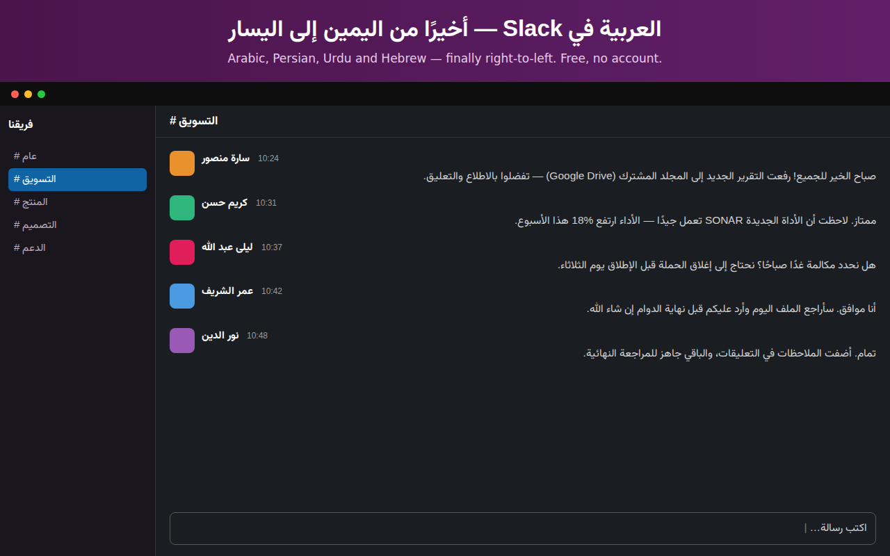
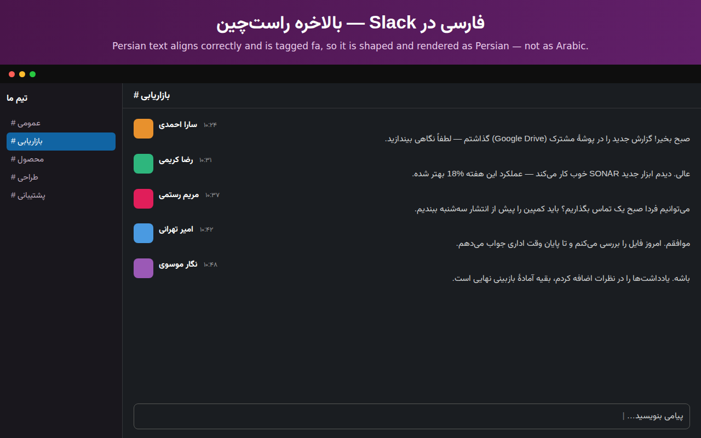
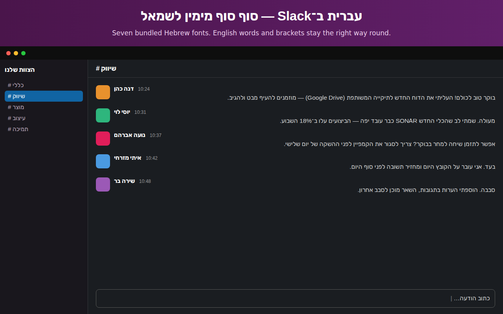

# RTL for Slack — Arabic, Persian, Urdu & Hebrew right-to-left

A free browser extension that makes Slack's web client render Arabic, Persian, Urdu and Hebrew
right-to-left correctly. Messages align properly, the composer flips direction as
you type, inline English and parentheses stay where they belong, Persian and Urdu
are tagged `fa`/`ur` rather than lumped in as Arabic, and you can pick a font for
the Arabic script and a font for Hebrew independently (12 bundled, including Noto
Nastaliq Urdu). Slack's own layout — avatars, timestamps, reactions, sidebar —
stays exactly where it is.

No account, no license key, no analytics, no network calls. MIT licensed.

**[Add to Chrome (free)](https://chromewebstore.google.com/detail/kkglhicljbajpdbmhohodoafmmnmmdfm)** · [Homepage](https://mpialtd.com/rtl-slack)







## The bug this fixes

Slack sets `dir="auto"` on message bodies and the composer. Per the HTML spec,
`dir="auto"` resolves direction from the **first strong character only**. That works
for a message that opens with a Hebrew word, and fails for everything else:

| Message starts with | Slack renders |
|---|---|
| `שלום צוות` | correct (RTL) |
| `@dana שלום צוות` | **broken** — mention is Latin, whole message goes LTR |
| `OK אז מה עושים` | **broken** — first strong char is Latin |
| `🎉 מזל טוב` | **broken** — emoji is neutral, next strong char decides |

In a real workspace most Hebrew messages start with a mention, an English product
name, or an emoji, so "correct" is the exception.

## How it works

**Majority-script detection, not first-character guessing.** `detectDirection()`
counts Hebrew/Arabic letters against Latin letters across the whole message and
picks the winner. A stray Hebrew word in an English paragraph stays LTR; a mostly-
Hebrew message that opens with `@dana` goes RTL. When a message has no RTL
characters at all the extension returns `null` and touches nothing.

**Messages get forced `direction: rtl` plus LTR isolates, not `plaintext`.**
`unicode-bidi: plaintext` re-introduces the same first-strong-character problem per
line, and mirrors an inline `(chrome extension)` into `)chrome extension(` because
the Unicode bracket-pair algorithm resolves the brackets in the RTL context. Instead,
Latin runs are wrapped in `<span dir="ltr">` isolates. The wrap is
alphanumeric-bounded, so in `ב-Gorgias (לא דרך הבוט)` it wraps `Gorgias` and leaves
the Hebrew parenthetical's bracket alone.

**The composer uses `unicode-bidi: plaintext`** — you can't safely rewrite a
contenteditable while someone types, and per-line auto-detection is the right
behavior for a live input.

**Text-only scope.** An earlier version mirrored the message gutter and reversed
English metadata (`1 hour ago` became `hour ago 1`). Styling is now scoped to the
message text container and the composer, nothing else.

## Install

From the store: **[Chrome Web Store](https://chromewebstore.google.com/detail/kkglhicljbajpdbmhohodoafmmnmmdfm)** (free).

From source:

```bash
git clone https://github.com/matan869/rtl-for-slack.git
```

Chrome/Edge — `chrome://extensions` → enable **Developer mode** → **Load unpacked** → select the folder.
Firefox — `about:debugging#/runtime/this-firefox` → **Load Temporary Add-on** → select `manifest.json`.

Then open or reload `app.slack.com`.

## Build

```bash
python build-stores.py   # writes build/rtl-for-slack-{edge,firefox}-vX.Y.Z.zip
```

Chrome and Edge ship `manifest.json` as-is. Firefox additionally needs
`browser_specific_settings.gecko.id`, injected at build time so the Chrome Web Store
never sees an unrecognized key.

## Privacy

Everything runs locally. No analytics, no remote code, no data collection, and no
network requests at runtime — all twelve fonts are bundled rather than fetched. Your
on/off, font, and size choices live in `storage.local` and never leave the device.
Permissions are `storage` and `https://app.slack.com/*`, and nothing else.

## Compatibility note

Slack changes its internal class names from time to time. If a Slack update breaks
rendering, the selectors in `styles.css` and `content.js` are where to look —
`.p-rich_text_block` / `.p-rich_text_section` for message text,
`[data-qa="texty_input"]` for the composer. Issues and PRs welcome.

## License

Code: [MIT](LICENSE).
Bundled fonts: SIL Open Font License 1.1 — see [fonts/LICENSE-FONTS.txt](fonts/LICENSE-FONTS.txt)
for per-font copyright (Assistant, Rubik, Heebo, Noto Sans Hebrew, Frank Ruhl Libre,
Secular One, Suez One).

Independent add-on, not affiliated with, endorsed by, or sponsored by Slack
Technologies, LLC.
